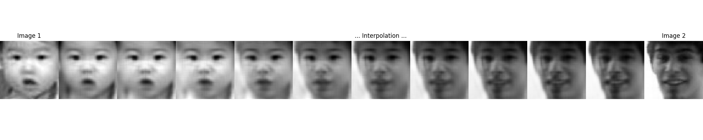
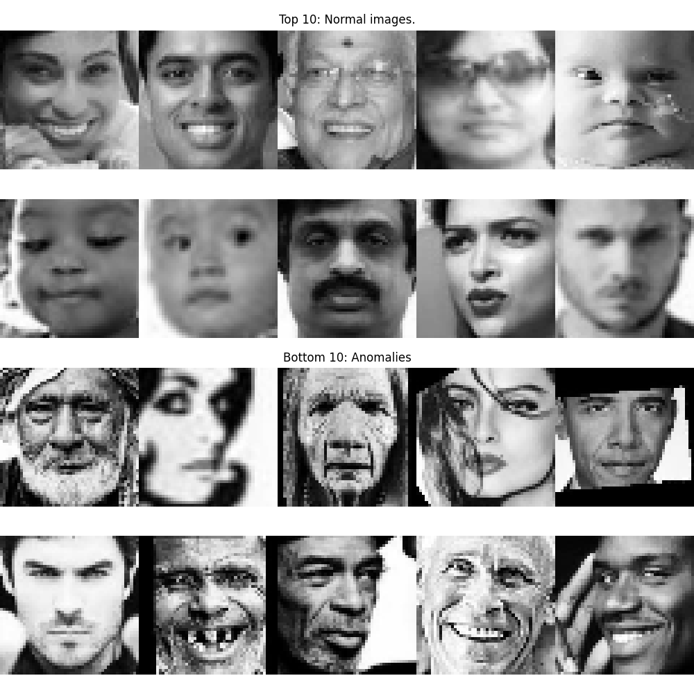
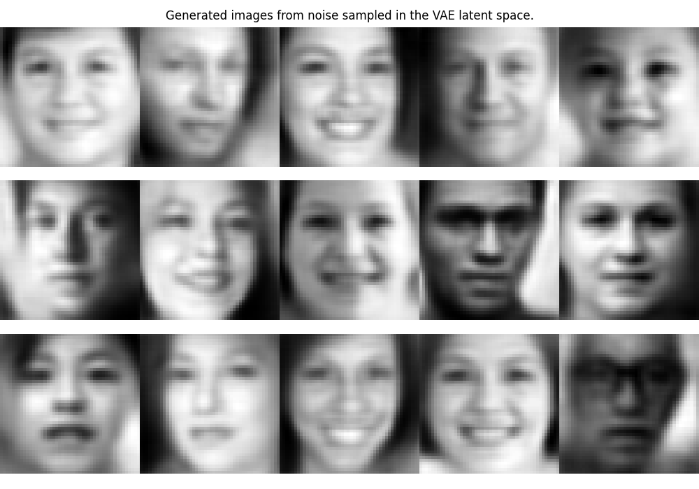

# Variational Autoencoder (VAE) & Autoencoder (AE) for Facial Anomaly Detection and Image Generation
 

 
This repository features deep learning models, **a Variational Autoencoder (VAE)** and **an Autoencoder (AE)**—designed for:

- (Facial) anomaly detection  
- Synthetic image generation  
- Dimensionality reduction using deep embeddings

Both models are based on a custom **ResNet-inspired convolutional neural network architecture** and trained on the [Age, Gender, and Ethnicity facial image dataset](https://www.kaggle.com/datasets/nipunarora8/age-gender-and-ethnicity-face-data-csv) from Kaggle.

 
 

## ⚙️ Variational Autoencoder (VAE)

The VAE learns a distribution of typical facial features, enabling it to detect anomalies or generate new, realistic faces from random latent vectors. 

### Example Highlight:
- **Anomaly Detection**: Detect unusual facial patterns via reconstruction loss

 

- **Generative AI**: Create synthetic face images from random latent noise 

 
 

### Major Files:
- `yuli_CNN_VAE_Resnet_main_.py` – Main script: trains model and generates examples  
- `yuli_CNN_VAE_Resnet_NNdataset_.py` – Dataset loader and preprocessor  
- `yuli_CNN_VAE_Resnet_NNmodel_.py` – VAE architecture with ResNet-style blocks
- `yuli_CNN_VAE_Resnet_train_.py` – VAE training loop with early stopping

 

### Example Usage:
- Anomaly Detection / Fraud Detection
- Sample synthetic faces
- Identify outliers

 
 

## ⚙️ Autoencoder (AE)

The AE version is a standard encoder-decoder network (also based on ResNet), useful for:

- Learning compact representations (embeddings)
- Performing **image compression**

 

### Example Highlight:
- **Compact Data Representations**: Morph one face into another by interpolating between two embeddings, which are the compact representations of images learned by the trained Autoencoder.

 

 

### Major Files:
- `yuli_CNN_AE_Resnet_main_.py` – Train model and generate visualizations  
- `yuli_CNN_AE_Resnet_NNdataset_.py` – Dataset loader  
- `yuli_CNN_AE_Resnet_NNmodel_.py` – AE architecture using ResNet-style layers  
- `yuli_CNN_AE_Resnet_train_.py` – AE training logic with early stopping
